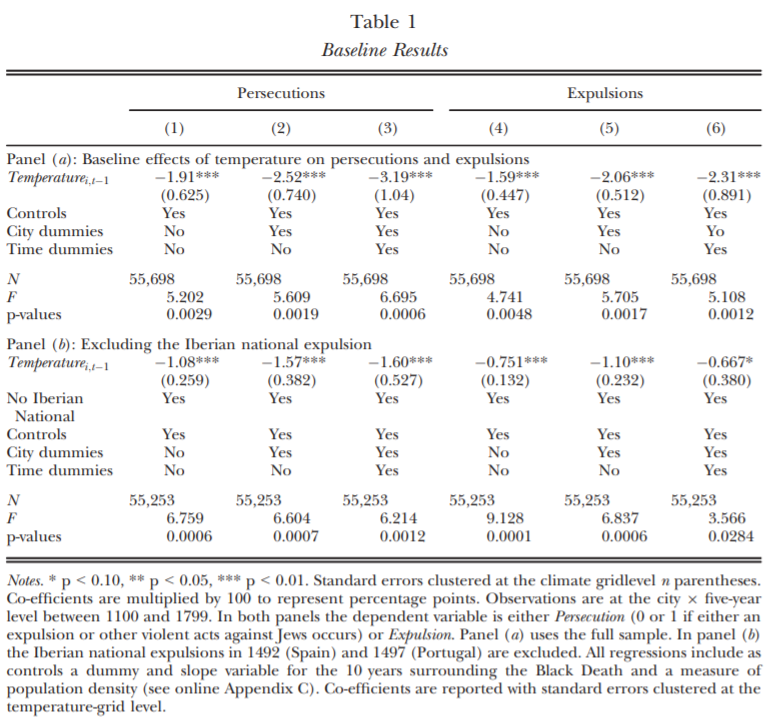

```{r setup, include=FALSE}
knitr::opts_chunk$set(echo = TRUE)
```

### 1. Introduction of the Paper

This project replicates and extends "Jewish Persecutions and Weather Shocks: 1100-1800" (Anderson, Johnson and Koyama 2017). This paper attempts to shed light on the relationship between economic shocks and the persecution of Jews in Europe of 1100-1800 by observing local temperature deviations. These deviations are used as a proxy for economic prosperity as they are highly correlated with agricultural output – the main source of income in the historical setting in question as well as a central consumption good, with the vast majority of the population consistently malnourished and consuming around the subsistence level. The authors suggest that economic shocks increase the persecution of Jews by functioning as an increase in the local ruler's discounting of future periods. The game analogous to this interaction is of an indefinitely repeated prisoner's dilemma, where the ruler's discount factor is exposed to stochastic shocks which may bring it below the cooperation threshold level. In more stable periods, the ruler can commit to protecting Jews and enforcing their property rights and thus benefit from their credit services in  the long run. But in less stable periods, seizing their property and diverting popular unrest towards Jews becomes more worthwhile.

The authors find that a one standard deviation decrease from the average growing season temperature in a particular locality increases the probability of persecution (pogroms or expulsions) in that locality by about one percent – a significant increase from a baseline of a 2 percent probability. They also find that more stable regimes were less sensitive to weather shocks – a result in line with their proposed mechanism. Additionally, they find that the relationship between weather shocks and persecutions gradually decreased between 1500 and 1800 – a result that they attribute to improved market integration on the continent reducing the exposure of local economies to local weather shocks.


### 2. Replication

#### 2.1 Data Preparation

The data for this paper can be downloaded from the Economic Journal's website on <https://academic.oup.com/ej/article/127/602/924/5069222#123999755>. The authors prefer estimating the effect of the average temperature deviation over five-year intervals in order to average out significant measurement error in the historical temperature data, and have prearranged a dataset accordingly. I load this dataset here, and replicate some variables that they use.

```{r Loading data, message=FALSE}
if (!require("pacman")) install.packages("pacman")
pacman::p_load(
  tidyverse,
  tidymodels,
  broom,
  fastDummies, # for turning categorical variables into a set of dummies
  fixest,      # for convenient fixed effects estimation and standard error clustering
  hdm,         # for double lasso
  stacks,      # for optimally averaging model predictions
  NeuralNetTools # for displaying nnet results
)

# Importing the data and constructing variables
fiveyear <- read.csv("Base Five Year Panel.csv") %>%
  as_tibble() %>%
  group_by(id) %>%
  mutate(
    lag1temperature  = lag(temperature, 1),
    lag2temperature  = lag(temperature, 2),
    lag3temperature  = lag(temperature, 3),
    lead1temperature = lead(temperature, 1),
    lead2temperature = lead(temperature, 2),
    lead3temperature = lead(temperature, 3)
  ) %>%
  ungroup() %>%
  filter(sample == 1 & !is.na(lag1temperature)) %>%
  mutate(
    lowsuitability = as.numeric(wheat150suit < mean(wheat150suit)),
    lowsuitXlag1temp = lowsuitability*lag1temperature,
    wheat150suitXlag1temperature = wheat150suit*lag1temperature,
    lowconstraint = as.numeric(ajrconstraint< mean(ajrconstraint)),
    lowconstraintXlag1temperature = lowconstraint*lag1temperature,
    lowcapital = as.numeric(ajrcapital< mean(ajrcapital)),
    lowcapitalXlag1temperature = lowcapital*lag1temperature,
    lowantiquity = as.numeric(stateantiquity < mean(stateantiquity)),
    lowantiquityXlag1temperature = lowantiquity*lag1temperature,
    persecutions = persecutions * 100 # for percent rather than decimal coefficients
  )
```


#### 2.2 Econometric Specification

The main specification is the fixed effects regression of city by five-year interval given below:
$$
  y_{it} = \beta T_{i,t-1} + \eta_i + \mu_t +X_{it}\Omega + \epsilon_{it}
$$
The outcome is a binary indicator for whether a persecution took place in city $i$ in period $t$, with the treatment being the average degrees Celsius deviation in the previous five years' growing season temperature from the city average. The regression also controls for population density and for the black death (controlling for both intercept and slope).

The authors cluster the standard errors by temperature grids. These grids are the various sources of the historical temperature data, from which the local temperatures are then computed. Since they provide quite noisy estimates, it makes sense to cluster localities whose temperatures are influenced by the same noise.


#### 2.3 Results

The paper's main result is reproduced below (note: the `fiveyear` variable is explicitly given dummies here just for technical reasons, to prevent `plague` from being omitted due to collinearity with the year fixed effects).

```{r Table 1, message=FALSE}
# Panel A
feols(persecutions ~ lag1temperature + popdensity + plague + slopeplague + factor(fiveyear) | id , data = fiveyear, cluster = "grid")

# Panel B: Excluding the Iberian national expulsion
feols(persecutions ~ lag1temperature + popdensity + plague + slopeplague + factor(fiveyear) | id , data = fiveyear %>% filter(nat1492 != 1 & nat1497 != 1), cluster = "grid")
```

This is virtually identical to the authors' preferred Regression 3 in Table 1.


What we have found is that a one degree Celsius decrease from the average growing season temperature increases the likelihood of persecution by around 3 percent, which is very large relative to a baseline probability of 2 percent. However, a one degree Celsius deviation from the average temperature is a very large deviation – if we translate this to a one standard deviation change, which is approximately a third of a degree Celsius, we get that such a change increases the likelihood of persecution by around one percent.

As discussed below, it is perhaps odd that the authors select this result rather than their smaller result from Panel B, which removes the less than 1 percent of the sample that suffered the Iberian national expulsions of 1492 and 1497 and sees the effect cut in half, or that they do not at least control for these expulsions in Panel A.


### 3. Extension – Double Lasso

The following block of code performs two double lasso variable selection procedures as a robustness test for the above results. Since the original regression was estimated using fixed effects, I have decided to take two approaches to the evaluation. The first double lasso procedure is performed on the sample after demeaning all the variables by city and locality. Thus, it can be understood as a "fixed effects double lasso". This procedure allows us to accept by assumption the authors' use of fixed effects and focus on the variables that are important in explaining the within variance in particular. This is my preferred approach, as the main benefit of double lasso is in its ability to identify unthought-of important controls, and not in its removal of weaker ones, which are relatively harmless to the traditional econometric goal of unbiasedness. Therefore, keeping the fixed effects is not a problematic choice.

(Remarks: here and in the second procedure I perform the procedure twice – once using the partialling out method and once using the double selection method. Their results are unsurprisingly similar. Additionally, I prevent the double lasso procedure from selecting any controls affected by the treatment – "bad controls" in the language of Angrist and Pischke. Thus, for example, all interactions with lagged temperature are omitted, and so is contemporaneous temperature. The omission of the latter may appear more controversial, but it is found to be insignificant in any case.)

```{r Double Lasso FE, message=FALSE}
# Demeaning the non-constant variables for a fixed-effects double lasso
fiveyear_FE <- demean(X = fiveyear %>%
                        select(persecutions, slopeplague, popdensity, stateantiquity, ajrcapital, ajrconstraint, nat1492, nat1497, starts_with("lag"), lowconstraint, lowcapital, lowantiquity),
                      f = fiveyear %>%
                        select(id, fiveyear))

# Double Lasso with Fixed Effects
y_FE <- fiveyear_FE$persecutions
d_FE <- fiveyear_FE$lag1temperature
x_FE <- fiveyear_FE %>%
  select(-persecutions, -lag1temperature) %>%
  as.matrix()
partial_out_FE <- rlassoEffect(x_FE, y_FE, d_FE, method = "partialling out")
double_selection_FE <- rlassoEffect(x_FE, y_FE, d_FE, method = "double selection")
```
```{r}
summary(partial_out_FE)
summary(double_selection_FE)
```


We have obtained a smaller, but still significant, effect, with the difference mostly attributable to the addition of controls for the Iberian national expulsions.

The second procedure is performed on the original, not demeaned sample, but with dummy variables for each city and for each time period. This allows the lasso procedure to opt not to select the controls imposed by the city and five-year fixed effects if the between variation does not generate much noise. As discussed in the previous paragraph, this is less interesting when our goal is the measurement of a causal effect, rather than prediction. In any case, the result strongly validates the use of fixed effects, as it selects a very large amount of the fixed effect dummies despite the lasso penalty. 288 out of 933 city dummies are selected (i.e 31 percent – a larger amount than I would have expected given the penalty involved), and 126 out of 139 time dummies are selected (i.e. 91 percent).

```{r Double Lasso FE selection, message=FALSE}
# Double Lasso with dummies for city and five-year period, not demeaned
y <- fiveyear$persecutions
d <- fiveyear$lag1temperature
x <- fiveyear %>%
  dummy_cols(select_columns = c("id", "fiveyear")) %>%   # creating dummies for city ID
  select(slopeplague, popdensity, stateantiquity, ajrcapital, ajrconstraint, nat1492, nat1497, lag2temperature, lag3temperature, lowconstraint, lowcapital, lowantiquity, starts_with("id_"), starts_with("fiveyear_")) %>%
  as.matrix()
partial_out <- rlassoEffect(x, y, d, method = "partialling out")
double_selection <- rlassoEffect(x, y, d, method = "double selection")
```
```{r}
summary(partial_out)
summary(double_selection)
```


The methodological tension between the two approaches is thus avoided in this instance, as the results are very similar to the estimation above and again significant.

The takeaway from this section is that – apart from the omission of controls for the Iberian national expulsions – the authors' results are quite robust to additional variable selection by double lasso. To illustrate this, note that once we omit the Iberian expulsion variables, we get treatment effects quite close to, and larger than, that presented by the authors:

```{r}
summary(rlassoEffect(x_FE[,-c(6:7)], y_FE, d_FE, method = "partialling out"))
summary(rlassoEffect(x_FE[,-c(6:7)], y_FE, d_FE, method = "double selection"))
summary(rlassoEffect(x[,-c(6:7)], y, d, method = "partialling out"))
summary(rlassoEffect(x[,-c(6:7)], y, d, method = "double selection"))
```
An argument might be made that the set of available controls is not sufficiently large to make the double-lasso procedure convincing. While I have some sympathy for this argument, I think this set of variables does a good job of reflecting the institutional climate in each city. Moreover, the stability of the treatment effect given the omission of many city dummies is also somewhat indicative of the result's robustness.


### Prediction

I first split the data into train and test sets 80:20 (44,558 and 11,140 observations, respectively), and further split the training set into five folds. For this exercise, I am of course generally happy to allow variables to be selected even if they clearly lack *causal* importance, but I do need to remove two variables. One is the expulsions variable, as it is one of the two events that define the persecution variable in the first place and is therefore uninformative. The other is the Jewish community proportion variable, as it is to some extent an outcome of the outcome variable. If we are seeking to guess historical events for the unusual event in which we lack documentation of persecutions but do have Jewish population data, then this is fine. But if we seek to predict in the truer sense of the word, then this variable is unhelpful.

Additionally, I add variables for $temperature^2$ and $temperature^3$ in order to allow the degree of the effect of temperature to vary with the size and direction of the deviation. I also convert the outcome to a factor variable and the year variable to numeric, and create $year^2$ and $year^3$ variables to capture any varying time trends. I am not very concerned about the polynomial variables resulting in an overfit because of the large size of the dataset (21,752 with the rainfall variable and 53,605 without it) relative to the number of variables

Finally, due to a technical issue with fitting the data for the different engines used in creating the model specifications, I create dummy variables manually from the categorical variables (country, century, and grid) rather than using the `step_dummy` function. Regrettably, I am obliged to omit the ID variable as the models fail to handle the large number of categories. The presence of country and grid categories, as well as the continuous longitude and latitude variables, go a decent way towards compensating for its absence.

```{r running models}
set.seed(1000)
split <- fiveyear %>%
    select(-expulsions, -jewishcomm50) %>%
    mutate(
        temperature2 = temperature^2,
        temperature3 = temperature^3,
        persecutions = as.factor(persecutions),
        fiveyear = as.numeric(fiveyear),
        fiveyear2 = fiveyear^2
    ) %>%
    dummy_cols(select_columns = c("country", "century", "grid")) %>%
    select(-c("id", "country", "century", "grid")) %>%
    na.omit() %>%
    initial_split(prop = 0.8)
train <- training(split)
test <- testing(split)
folds <- train %>% vfold_cv(v = 5)
```


#### Creating the models

I use the `stacks` package to train a variety of models and average their predictions. To this end, I create sets of models, using `parsnip`, of several types – lasso, ridge, random forest, gradient boosting, and neural network – which I then combine with `stacks`.

In terms of relationships between variables, much of the work has already been done for me by the authors, who have included (with well-reasoned justifications) interactions between a large proportion of the variables which they use for their robustness checks. I add an interactions of the rainfall data with population density, under the assumption that more populous cities are more vulnerable to droughts. 

```{r stacks models}
# Specifying the general recipe
general_rec <- recipe(persecutions ~ ., data = train) %>%
  step_zv(all_predictors()) %>%
  step_interact(~ rainfall:popdensity) %>%
  step_dummy(all_nominal_predictors())

### Lasso
# Regression model definition
lasso_spec <- logistic_reg() %>%
  set_args(penalty = tune(), mixture = 1) %>%
  set_engine("glmnet") %>%
  set_mode("classification")
# Regression (both Lasso and Ridge) recipe
reg_rec <- general_rec %>%
  step_normalize(all_numeric(), skip = TRUE)  # standardizing all variables
# Lasso workflow (adding model and recipe)
lasso_wf <- workflow() %>%
  add_model(lasso_spec) %>%
  add_recipe(reg_rec)
# Tuning penalty and mixture, and fitting to the 5-fold cv
lasso_res <- lasso_wf %>%
  tune_grid(
    resamples = folds,
    metrics = metric_set(roc_auc),
    grid = grid_latin_hypercube(penalty(), size = 20),
    control = control_stack_grid()
  )

#lasso_res$.notes[[1]][[".notes"]]


### Ridge
# Regression model definition
ridge_spec <- logistic_reg() %>%
  set_args(penalty = tune(), mixture = 0) %>%
  set_engine("glmnet") %>%
  set_mode("classification")
# Ridge workflow (adding model and recipe)
ridge_wf <- workflow() %>%
  add_model(ridge_spec) %>%
  add_recipe(reg_rec)
# Tuning penalty and mixture, and fitting to the 5-fold cv
ridge_res <- ridge_wf %>%
  tune_grid(
    resamples = folds,
    metrics = metric_set(roc_auc),
    grid = grid_latin_hypercube(penalty(), size = 20),
    control = control_stack_grid()
  )


### Random Forest
# Random forest model definition
rf_spec <- rand_forest(
    mtry = tune(),
    min_n = tune(),
    trees = tune()
  ) %>%
  set_mode("classification") %>%
  set_engine("randomForest")
# Random forest workflow
rf_wf <- workflow() %>%
  add_model(rf_spec) %>%
  add_recipe(general_rec)
# Tuning parameters, and fitting to the 5-fold cv
rf_res <- rf_wf %>%
  tune_grid(
    resamples = folds,
    metrics = metric_set(roc_auc),
    grid = grid_latin_hypercube(
      mtry(range = c(1L, 10L)),
      min_n(),
      trees(range = c(500L, 1500L)),
      size = 50
    ),
    control = control_stack_grid()
  )


### Gradient Boosting
# Boosting model definition
xgb_spec <- boost_tree(
    mtry = tune(),
    min_n = tune(),
    trees = tune(),
    tree_depth = tune(),
    learn_rate = tune(),
    loss_reduction = tune(),
    sample_size = tune()
  ) %>%
  set_mode("classification") %>%
  set_engine("xgboost")
# Boosting workflow
xgb_wf <- workflow() %>%
  add_model(xgb_spec) %>%
  add_recipe(general_rec)
# Tuning parameters, and fitting to the 5-fold cv
xgb_res <- xgb_wf %>%
  tune_grid(
    resamples = folds,
    metrics = metric_set(roc_auc),
    grid = grid_latin_hypercube(
      tree_depth(),
      min_n(),
      loss_reduction(),
      sample_size = sample_prop(range = c(0.65, 1)),
      mtry(range = c(35L, 44L)),
      trees(range = c(500L, 1500L)),
      learn_rate(),
      size = 100
    ),
    control = control_stack_grid()
  )


### Neural Network
# NN model definition
nnet_spec <- mlp(
  hidden_units = tune(),
  penalty = tune(),
  epochs = tune()
) %>%
  set_engine("nnet") %>%
  set_mode("classification")
# NN recipe extension
nnet_rec <- general_rec %>%
  step_normalize(all_predictors()) %>%
  step_corr(all_predictors())
# NN workflow (adding model and recipe)
nnet_wf <- workflow() %>%
  add_model(nnet_spec) %>%
  add_recipe(nnet_rec)
# Tuning penalty and mixture, and fitting to the 5-fold cv
nnet_res <- nnet_wf %>%
  tune_grid(
    resamples = folds,
    metrics = metric_set(roc_auc),
    grid = grid_latin_hypercube(
      penalty(),
      hidden_units(),
      epochs(),
      size = 100
    ),
    control = control_stack_grid()
  )

```


#### Creating and examining the different model types  {.tabset .tabset-fade .tabset-pills}

I use the `stacks` package to train a variety of models and average their predictions. To this end, I create sets of models, using `parsnip`, of several types – lasso, ridge, random forest, gradient boosting, and neural network – which I then combine with `stacks`.

In terms of relationships between variables, much of the work has already been done for me by the authors, who have included (with well-reasoned justifications) interactions between a large proportion of the variables which they use for their robustness checks. I add an interaction of the rainfall data with population density, under the assumption that more populous cities are more vulnerable to droughts. 

```{r}
# Specifying the general recipe
general_rec <- recipe(persecutions ~ ., data = train) %>%
  step_zv(all_predictors()) %>%
  step_interact(~ rainfall:popdensity) %>%
  step_dummy(all_nominal_predictors())
```

##### Lasso
```{r}
# Lasso model definition
lasso_spec <- logistic_reg() %>%
  set_args(penalty = tune(), mixture = 1) %>%
  set_engine("glmnet") %>%
  set_mode("classification")
# Regression (both Lasso and Ridge) recipe
reg_rec <- general_rec %>%
  step_normalize(all_numeric(), skip = TRUE)  # standardizing all variables
# Lasso workflow (adding model and recipe)
lasso_wf <- workflow() %>%
  add_model(lasso_spec) %>%
  add_recipe(reg_rec)
# Tuning penalty and mixture, and fitting to the 5-fold cv
lasso_res <- lasso_wf %>%
  tune_grid(
    resamples = folds,
    metrics = metric_set(roc_auc),
    grid = grid_latin_hypercube(penalty(), size = 20),
    control = control_stack_grid()
  )


# Top results
lasso_res %>% show_best("roc_auc") %>% select(-n, -.config)
# Variable importance in best by 1se model
finalize_workflow(
  lasso_wf,
  lasso_res %>% select_by_one_std_err(metric = "roc_auc", desc(penalty))
) %>%
  fit(train) %>%
  extract_fit_parsnip() %>%
  vip::vip()

# Removing workflow object to free up memory for next parts
rm(lasso_wf)
```

##### Ridge
```{r}
# Ridge model definition
ridge_spec <- logistic_reg() %>%
  set_args(penalty = tune(), mixture = 0) %>%
  set_engine("glmnet") %>%
  set_mode("classification")
# Ridge workflow (adding model and recipe)
ridge_wf <- workflow() %>%
  add_model(ridge_spec) %>%
  add_recipe(reg_rec)
# Tuning penalty and mixture, and fitting to the 5-fold cv
ridge_res <- ridge_wf %>%
  tune_grid(
    resamples = folds,
    metrics = metric_set(roc_auc),
    grid = grid_latin_hypercube(penalty(), size = 20),
    control = control_stack_grid()
  )


# Top results
ridge_res %>% show_best("roc_auc") %>% select(-n, -.config)
# Variable importance in best by 1se model
finalize_workflow(
  ridge_wf,
  ridge_res %>% select_by_one_std_err(metric = "roc_auc", desc(penalty))
) %>%
  fit(train) %>%
  extract_fit_parsnip() %>%
  vip::vip()

# Removing workflow object to free up memory for next parts
rm(ridge_wf)
```

##### Random Forest
```{r}
# Random forest model definition
rf_spec <- rand_forest(
    mtry = tune(),
    min_n = tune(),
    trees = tune()
  ) %>%
  set_mode("classification") %>%
  set_engine("randomForest")
# Random forest workflow
rf_wf <- workflow() %>%
  add_model(rf_spec) %>%
  add_recipe(general_rec)
# Tuning parameters, and fitting to the 5-fold cv
rf_res <- rf_wf %>%
  tune_grid(
    resamples = folds,
    metrics = metric_set(roc_auc),
    grid = grid_latin_hypercube(
      mtry(range = c(1L, 10L)),
      min_n(),
      trees(range = c(500L, 1500L)),
      size = 50
    ),
    control = control_stack_grid()
  )


# Top results
rf_res %>% show_best("roc_auc") %>% select(-n, -.config)
# Variable importance in best model
finalize_workflow(
  rf_wf,
  rf_res %>% select_best(metric = "roc_auc")
) %>%
  fit(train) %>%
  extract_fit_parsnip() %>%
  vip::vip()

# Removing workflow object to free up memory for next parts
rm(rf_wf)
```

##### Gradient Boosting
```{r}
# Boosting model definition
xgb_spec <- boost_tree(
    mtry = tune(),
    min_n = tune(),
    trees = tune(),
    tree_depth = tune(),
    learn_rate = tune(),
    loss_reduction = tune(),
    sample_size = tune()
  ) %>%
  set_mode("classification") %>%
  set_engine("xgboost")
# Boosting workflow
xgb_wf <- workflow() %>%
  add_model(xgb_spec) %>%
  add_recipe(general_rec)
# Tuning parameters, and fitting to the 5-fold cv
xgb_res <- xgb_wf %>%
  tune_grid(
    resamples = folds,
    metrics = metric_set(roc_auc),
    grid = grid_latin_hypercube(
      tree_depth(),
      min_n(),
      loss_reduction(),
      sample_size = sample_prop(range = c(0.65, 1)),
      mtry(range = c(35L, 44L)),
      trees(range = c(500L, 1500L)),
      learn_rate(),
      size = 100
    ),
    control = control_stack_grid()
  )


# Top results
xgb_res %>% show_best("roc_auc") %>% select(-.estimator, -n, -.config)
# Variable importance in best model
finalize_workflow(
  xgb_wf,
  xgb_res %>% select_best(metric = "roc_auc")
) %>%
  fit(train) %>%
  extract_fit_parsnip() %>%
  vip::vip()

# Removing workflow object to free up memory for next parts
rm(xgb_wf)
```

##### Neural Network
```{r}
# NN model definition
nnet_spec <- mlp(
  hidden_units = tune(),
  penalty = tune(),
  epochs = tune()
) %>%
  set_engine("nnet") %>%
  set_mode("classification")
# NN recipe extension
nnet_rec <- general_rec %>%
  step_normalize(all_predictors()) %>%
  step_corr(all_predictors())
# NN workflow (adding model and recipe)
nnet_wf <- workflow() %>%
  add_model(nnet_spec) %>%
  add_recipe(nnet_rec)
# Tuning penalty and mixture, and fitting to the 5-fold cv
nnet_res <- nnet_wf %>%
  tune_grid(
    resamples = folds,
    metrics = metric_set(roc_auc),
    grid = grid_latin_hypercube(
      penalty(),
      hidden_units(),
      epochs(),
      size = 100
    ),
    control = control_stack_grid()
  )


# Top results
nnet_res %>% show_best("roc_auc") %>% select(-n, -.config)
# Variable importance in best by 1se model
finalize_workflow(
  nnet_wf,
  nnet_res %>% select_by_one_std_err(metric = "roc_auc", desc(penalty))
) %>%
  fit(train) %>%
  extract_fit_parsnip() %>%
  vip::vip()

# Removing workflow object to free up memory for next parts
rm(nnet_wf)
```


#### Brief discussion of model-specific results

The explanatory variable used by the authors – `lag1temperature` – figures in the models but does not stand out especially. Temperature in other periods is given at least as much, and often more, weight. One interesting result is that the temperature in the years following the persecution are often useful for classification. This is most likely due to the correlation of future and past deviations in temperature, which remains positive even as far as three five-year periods forward (presumably due to more prolonged climate changes). The past temperature variables may not suffice due to the significant measurement error that they include, and so perhaps future temperatures complement this data by hinting that the past temperature was not really as reported.

It is also interesting to note that the regression methods and the neural network method tend to identify specific regions and periods with more persecutions as important, as well as emphasizing institutional features of the cities (executive power, degree of capital protection, etc.) whereas the forest methods place a larger emphasis on climatic and geographic features of cities (temperatures, rainfall, and soil suitability for wheat growth). In terms of making inferences with respect to the causal model, viewing each model individually is therefore perhaps more enlightening. It would be wrong to conclude that the previous period's temperature is not in particular important, despite its relatively lesser weight here, because temperature in general appears important and measurement error must to some extent be responsible for dulling the observed relationship. Additionally, the authors' secondary arguments regarding the role of institutions in accentuating the effect of weather (not covered here) are lent some support by the variable importance results.

#### Finalizing the model with `Stacks`

```{r stacking, message=FALSE, warning=FALSE}
stack <- stacks() %>%
  add_candidates(lasso_res) %>%
  add_candidates(ridge_res) %>%
  add_candidates(rf_res) %>%
  add_candidates(xgb_res) %>%
  add_candidates(nnet_res) %>%
  blend_predictions() %>%
  fit_members()
```


The package picks the penalty that provides the optimal results (in this case, defined as the ROC-AUC. The higher the penalty is, the less models are used in the stack's predictions, as shown by the first graph (here, the stack uses a penalty of 1e-02). We can see in the second graph that the weaker predictive success of the regression methods results in them not being picked for the final evaluation.

```{r stack plots}
autoplot(stack)
autoplot(stack, type = "weights")
```


The following block of code generates the predictions, first in sample and then out of sample. I calculate their corresponding AUCs:

```{r, message=FALSE}
# In sample
stack_train_pred <- fct_rev(train$persecutions) %>% bind_cols(predict(stack, new_data = train, type = "prob")) %>%
  rename(
    persecutions = ...1,
    stack_pred = .pred_100
  ) %>%
  select(persecutions, stack_pred)
stack_train_pred %>% roc_auc(persecutions, stack_pred)

# Out of sample
stack_test_pred <- fct_rev(test$persecutions) %>% bind_cols(predict(stack, new_data = test, type = "prob")) %>%
  rename(
    persecutions = ...1,
    stack_pred = .pred_100
  ) %>%
  select(persecutions, stack_pred)
stack_test_pred %>% roc_auc(persecutions, stack_pred)

# ROC curves
rbind(
  stack_train_pred %>%
    roc_curve(persecutions, stack_pred) %>%
    mutate(curve = "in sample"),
  stack_test_pred %>%
    roc_curve(persecutions, stack_pred) %>%
    mutate(curve = "out of sample")
) %>%
  ggplot(aes(x = 1 - specificity, y = sensitivity, color = curve)) +
  geom_path() +
  geom_abline(lty = 3)
```

The extremely high in-sample AUC indicates that the model suffers from some overfitting, but an AUC of 0.723 seems quite respectable considering that the outcome in question is very rare – a feature which reduces the variance which the model can use to learn to recognize persecutions.


### References
Anderson, Robert Warren, Noel D. Johnson, and Mark Koyama. "Jewish persecutions and weather shocks: 1100–1800." *The Economic Journal* 127.602 (2017): 924-958.
